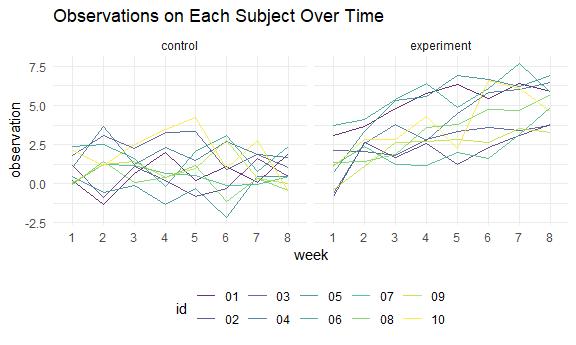

Homework 5
================
Yihan Feng
11/16/2020

## Problem 1

Read in the data.

``` r
homicide_df = 
  read_csv("homicide_data/homicide-data.csv") %>% 
  mutate(
    city_state = str_c(city, state, sep = "_"),
    resolved = case_when(
      disposition == "Closed without arrest" ~ "unsolved",
      disposition == "Open/No arrest"        ~ "unsolved",
      disposition == "Closed by arrest"      ~ "solved",
    )
  ) %>% 
  select(city_state, resolved) %>% 
  filter(city_state != "Tulsa_AL")
```

    ## Parsed with column specification:
    ## cols(
    ##   uid = col_character(),
    ##   reported_date = col_double(),
    ##   victim_last = col_character(),
    ##   victim_first = col_character(),
    ##   victim_race = col_character(),
    ##   victim_age = col_character(),
    ##   victim_sex = col_character(),
    ##   city = col_character(),
    ##   state = col_character(),
    ##   lat = col_double(),
    ##   lon = col_double(),
    ##   disposition = col_character()
    ## )

Let’s look at this a bit

``` r
aggregate_df = 
  homicide_df %>% 
  group_by(city_state) %>% 
  summarize(
    hom_total = n(),
    hom_unsolved = sum(resolved == "unsolved")
  )
```

    ## `summarise()` ungrouping output (override with `.groups` argument)

Can I do a prop test for a single city?

``` r
prop.test(
  aggregate_df %>% filter(city_state == "Baltimore_MD") %>% pull(hom_unsolved), 
  aggregate_df %>% filter(city_state == "Baltimore_MD") %>% pull(hom_total)) %>% 
  broom::tidy()
```

    ## # A tibble: 1 x 8
    ##   estimate statistic  p.value parameter conf.low conf.high method    alternative
    ##      <dbl>     <dbl>    <dbl>     <int>    <dbl>     <dbl> <chr>     <chr>      
    ## 1    0.646      239. 6.46e-54         1    0.628     0.663 1-sample~ two.sided

Try to iterate ……..

``` r
results_df = 
  aggregate_df %>% 
  mutate(
    prop_tests = map2(.x = hom_unsolved, .y = hom_total, ~prop.test(x = .x, n = .y)),
    tidy_tests = map(.x = prop_tests, ~broom::tidy(.x))
  ) %>% 
  select(-prop_tests) %>% 
  unnest(tidy_tests) %>% 
  select(city_state, estimate, conf.low, conf.high)
```

``` r
results_df %>% 
  mutate(city_state = fct_reorder(city_state, estimate)) %>% 
  ggplot(aes(x = city_state, y = estimate)) +
  geom_point() + 
  geom_errorbar(aes(ymin = conf.low, ymax = conf.high)) + 
  theme(axis.text.x = element_text(angle = 90, vjust = 0.5, hjust = 1))
```


## Problem 2

### import, unnest, and clean the data sets

``` r
path_df <- 
  tibble(
    path = list.files("./lda_data")
    ) %>% 
  mutate(
    path = str_c("./lda_data/", path),
    data = map(.x = path, ~read_csv(.x))) %>%
  unnest() %>%
  mutate(
    path = str_replace(path, "./lda_data/", ""), 
    path = str_replace(path, ".csv", "")
  ) %>%
  separate(path, into = c("group", "id"), sep = "_") %>%
  pivot_longer(
    week_1 : week_8, 
    names_to = "week", 
    names_prefix = "week_",
    values_to = "observation"
  ) %>%
  mutate(
    group = str_replace(group, "con", "control"),
    group = str_replace(group, "exp", "experiment")
  )
```

    ## Warning: `cols` is now required when using unnest().
    ## Please use `cols = c(data)`

### Spaghetti plot

``` r
path_plot <- path_df %>%
  ggplot(aes(x = week, y = observation, group = id, color = id)) + 
  geom_line(alpha = 0.8) + 
  facet_grid(~group) +
  labs(title = "Observations on Each Subject Over Time")
path_plot
```



According to the Spaghetti plot, the experimental group shows increasing
values of observation in eight weeks. Comparatively, the control group
doesn’t have obvious increasing or decreasing in observation values
overall. For both groups, the observation values are not increasing
gradually or keeping constant over time, but fluctuating a lot.

## Problem 3

### Simulation

In this simulation, we want to explore power in a one-sample t-test. /
Null hypothesis: \(\mu\) equals 0 / Alternative hypothesis: \(\mu\)
doesn’t equal 0 /

Set up the simulation function and t test

``` r
set.seed(2333)

sim_fxn <- function(n = 30, mu, sigma = 5){
  x = rnorm(n, mean = mu, sd = sigma)
  test <- t.test(x = x, alternative = "two.sided", conf.level = 0.95) %>%
    broom::tidy() %>%
    select(estimate, p.value)
}
```

simulation when mu equals 0

``` r
sim_mu_0 <- rerun(5000, sim_fxn(mu = 0)) %>%
  bind_rows()
```

simulation when mu equals 0, 1, 2, 3, 4, 5, 6

``` r
sim <- 
  tibble(mu = c(0,1,2,3,4,5,6)) %>%
  mutate(output = map(.x = mu, ~rerun(5000, sim_fxn(mu = .x))),
         result = map(output, bind_rows)) %>%
  select(-output) %>%
  unnest()  
```

    ## Warning: `cols` is now required when using unnest().
    ## Please use `cols = c(result)`

### Plots

Plot 1: power of the test (y) vs. the true value of mu (x)

``` r
sim_plot_1 <- 
  sim %>%
  group_by(mu) %>%
  summarize(p_value = sum(p.value < 0.05), 
            number = n(), 
            reject_prop = p_value/number) %>%
  ggplot(aes(x = mu, y = reject_prop)) + 
  geom_point() + 
  geom_smooth() +
  labs(
    x = "True Mean", 
    y = "Proportion of Rejecting Null Hypothesis"
  )

sim_plot_1
```


According to Plot 1, as the true mean increases, the proportion of
rejecting null hypothesis also increases. In other words, as the effect
size increases, the power of the test also increases.

Plot 2: the average estimate of \(\hat{\mu}\) (y) vs. true value of
\(\mu\) (x)

``` r
sim_plot_2 <- 
  sim %>%
  group_by(mu) %>%
  summarize(estimate_avg = mean(estimate)) %>%
  ggplot(aes(x = mu, y = estimate_avg)) + 
  geom_point() +
  geom_smooth(color = "green") +
  labs(
    x = "True Mean", 
    y = "Average of Estimated Mean", 
    title = " Average of Estimated Mean vs. True Mean Among All Samples"
  )

sim_plot_2
```


Plot 3: the average estimate of \(\hat{\mu}\) in rejected null
hypothesis (y) vs. true value of \(\mu\) (x)

``` r
sim_plot_3 <- 
  sim %>%
  filter(p.value < 0.05) %>%
  group_by(mu) %>%
  summarize(estimate_avg = mean(estimate)) %>%
  ggplot(aes(x = mu, y = estimate_avg)) + 
  geom_point() +
  geom_smooth(color = "blue") +
  labs(
    x = "True Mean", 
    y = "Average of Estimated Mean",
    title = " Average of Estimated Mean vs. True Mean Among Rejected Samples"
  )

sim_plot_3
```


  - According to Plot 3, the average estimated mu is close to the true
    mean when mu equals 0, 3, 4, 5, and 6; while the average estimated
    mu differs from the true mean when mu equals 1 and 2.

  - From the test and plot 1, we can observe that the power of test is
    about 1 when mu = 3, 4, 5. It means that the test is able to reject
    the samples that their estimated mu doesn’t equal to 0, so the
    rejected samples have their estimated mu closer to their true mean
    (3 or 4 or 5 or 6).

  - Comparatively, when mu = 1 and 2, the power of test is much lower
    than 0.5. It means that the test is not able to reject all samples
    that their estimated mu doesn’t equal to 0, so the rejected samples
    have their estimated mu more variant from their true mean.

  - When mu = 0, it is a different story. The rejected samples have
    their estimated mu close to their true mean, 0, which is exactly the
    null hypothesis. Therefore, even though its power of test is
    relatively low, the rejected samples’ estimated mu is still close to
    the true mean.
